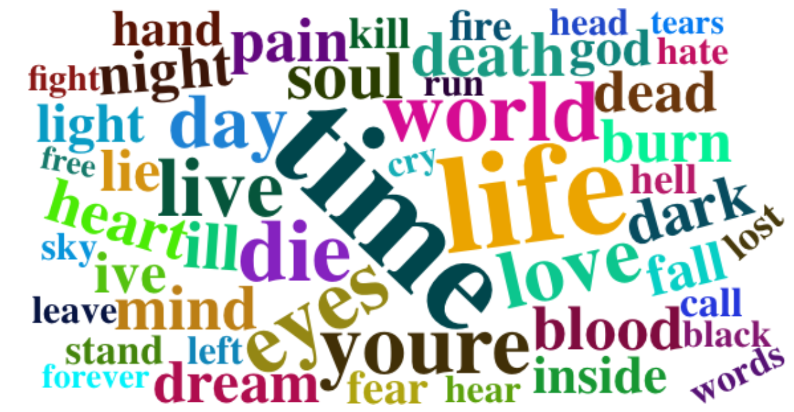
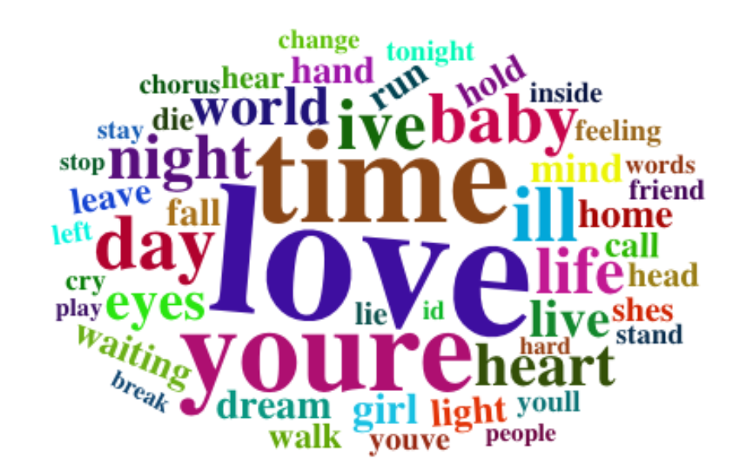

# Heavy Metal: the Rebel Child of Rock
```{r pressure, echo=FALSE}

```
In the 1960s, rock music was the one of the most prevalent and significant music genre in the US, from which many subgenre emerge. Metal was one of them. Different from rock music that encompass a wide range of themes and styles, metal music was known for its dark and rebellious theme. In this project, I am going to examine the lyrics from metal music and find out, despite stereotype, how different is the theme between metal and rock music.

```{r include=FALSE}
load("/Users/kexinsu/Documents/GitHub/Spring2020-Project1-ColleenSu08/output/processed_lyrics.RData")
library(dplyr)
library(tidyr)
library(ggplot2)
library("sentimentr")
library(textrank)
library(topicmodels)
library(tidytext)

metal <- dt_lyrics%>%filter(genre=='Metal')
rock <- dt_lyrics%>%filter(genre=='Rock')

split_metal <- get_sentences(metal$stemmedwords)
split_rock <- get_sentences(rock$stemmedwords)
```
## What are the words that are most frequently used by the two genre?
###Metal
```{r pressure, echo=FALSE}

```
### Rock
```{r pressure, echo=FALSE}

```
Using the ShinyApp, we are able to see the 50 most frequently used words in the lyrics of these two genres. 

## Comparing the sentiment (polarity) of metal and rock music
For acquiring the sentiment scores, I used the sentiment_by() method from sentimentr package. It returns  
```{r echo=FALSE}
sent_metal=sentiment_by(metal$stemmedwords)
sent_rock=sentiment_by(rock$stemmedwords)
summary(sent_metal$ave_sentiment)
summary(sent_rock$ave_sentiment)
```

```{r echo=FALSE}
emo <- emotion(metal$stemmedwords)
qplot(sent_metal$ave_sentiment,binwidth=0.1,main="Sentiment Score for Metal",xlab = 'Sentiment Score', ylab = 'Frequency')+geom_histogram(color="darkblue", fill="lightblue")+theme_light()
qplot(sent_rock$ave_sentiment,binwidth=0.1,main="Sentiment Score for Rock",xlab = 'Sentiment Score', ylab = 'Frequency')+geom_histogram(color="#CC79A7", fill="pink")+theme_light()
```

```{r echo=FALSE}
sent_metal <- my_data %>% unnest %>% get_sentences() %>% sentiment()

metal <- metal%>%mutate(element_id = row_number())%>%
  inner_join(sentiment(split_metal))%>%
  select(c(element_id,year,stemmedwords,word_count,sentiment))%>%
  mutate(sentiment=as.numeric(format(round(sentiment,3),scientific=F)))
#sent_year <- metal%>%group_by(year)%>%summarise(avg_sent=mean(sentiment))

ggplot(metal,aes(x=year,y=sentiment,group=year))+
  geom_boxplot()+
  ggtitle("Sentiment Score by Year")+
  theme_light()+
  theme(plot.title = element_text(hjust = 0.5))

rock <- rock%>%mutate(element_id = row_number())%>%
  inner_join(sentiment(split_rock))%>%
  select(c(element_id,year,stemmedwords,word_count,sentiment))%>%
  mutate(sentiment=as.numeric(format(round(sentiment,3),scientific=F)))
#sent_year_rock <- metal%>%group_by(year)%>%summarise(avg_sent=mean(sentiment))

ggplot(rock,aes(x=year,y=sentiment,group=year))+
  geom_boxplot()+
  ggtitle("Sentiment Score by Year")+
  theme_light()+
  theme(plot.title = element_text(hjust = 0.5))
```

```{r echo=FALSE}
emo <- emotion(split_metal)
emo_noFacet <-plot(emo,facet = 'negated')

emo_rock <- emotion(split_rock)
emo_noFacet_rock <-plot(emo_rock, facet = 'negated',main='Emotions of Rock')
```
